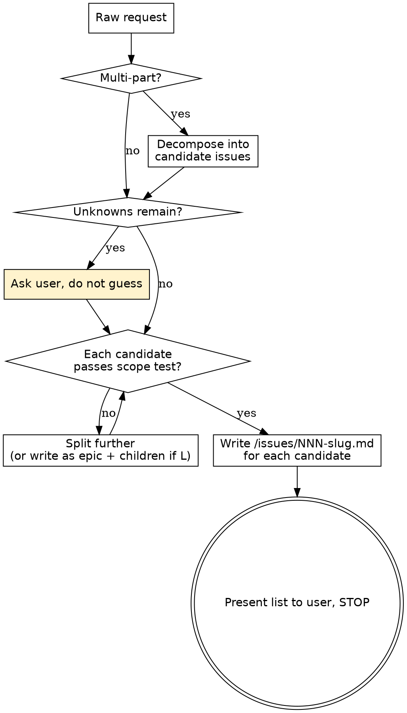

# Feature Grooming

## Overview

LLMs have a finite context window. Implementation reliability collapses when one attempt has to hold the codebase, the design system, and several loosely related changes at once. **Grooming is the discipline of cutting work down to one focused change small enough to be done correctly in a single attempt.**

A **groomed issue** is a markdown file in `/issues/` that:

- Touches **one** component, function, route, config file, or content file
- Has explicit inputs, outputs, and acceptance criteria
- Lists which skills and docs to read at implementation time
- Has no "and then" coupling — every "and" is a signal to split

When work is too big for one issue but coheres as a unit, write an **epic** — a parent issue with no implementation, whose body lists its child issue IDs. Each child is still a regular groomed issue and points back via `parent: <NNN>`. The epic itself is never implemented directly — only its children are. See **Epics and sub-issues** below.

**Grooming and building are separate turns.** This skill produces issues; a later turn implements one. Violating the letter of that separation violates its spirit.

## When to use

Invoke when you see any of:

- A multi-sentence feature request ("build the home page and wire the map")
- Verbs like "build / add / set up / scaffold / wire" applied to a feature, not a single line
- The word "and" connecting two distinct artifacts
- An ask that names more than one file or component
- An ask that does not reference an existing `/issues/NNN-*.md` path
- You are about to write code without a groomed issue file open

**Do NOT use** when:

- The user references a groomed issue by its file path
- The task is a single literal edit to an existing file ("fix typo on line 42")
- The user explicitly says "skip grooming"

## The flow



## Scope test

Every issue must satisfy **all** of these. If any check fails, split or clarify and re-check.

| Check | Pass criterion |
|---|---|
| Single artifact | Touches at most one of: one component, one page route, one function, one config file, one content file |
| File count | Changes ≤ 3 files total (primary + at most one wiring import + one styles or test file) |
| No conjunctive scope | The goal sentence contains no "and" / "then" / "also" connecting distinct artifacts |
| Concrete acceptance | 3–7 acceptance bullets, each independently verifiable by reading rendered HTML, running `npm run check`, or running `npm run build` |
| No open research | Every input value, path, and dependency is named explicitly. No "figure out X" sub-tasks |
| Estimated size ≤ M | See sizing table below; anything L re-decomposes |

## Sizing heuristic

| Size | New/changed lines | Files | Decision |
|---|---|---|---|
| S | ≤ 50 | 1 | Groom and go |
| M | ≤ 150 | 2–3 | Groom and go |
| L | > 150 or 4+ files | — | **Write as an epic + child issues.** The epic groups the work; each child is a regular S/M issue with `parent: <NNN>` pointing to the epic. |

Estimate *new or changed* lines, not total file size. When uncertain, round up. An L is always wrong as a single implementable issue — but the epic + children pattern lets you preserve the conceptual grouping.

## Epics and sub-issues

Some work is too big for one issue but coheres as a unit — a multi-file feature, a templated bulk creation, a UI surface with several independent pieces. Use an **epic** to group it.

An epic is an issue with `status: epic` and **no** `size` or `touches` fields. It does not get implemented directly. Its body lists its child issues. Each child is a regular groomed issue with `parent: <NNN>` in its frontmatter pointing at the epic.

**Use an epic when:**

- The work naturally splits into ≥ 3 child issues
- The children share enough context that bundling the explanation in one place avoids repetition
- You want a single "is this done?" checkbox to track the group

**Do NOT use an epic when:**

- 1–2 issues would suffice — just write them with explicit `depends_on`
- The "grouping" is just coincidence (different work that happens to land in the same week)
- You are tempted to put implementation steps in the epic body. Implementation lives in children. Epic bodies only describe and list.

**Epic body must include:**

- A `## Children` section: bulleted list of child IDs and one-line summaries
- `## Acceptance`: "all children completed" — no other criteria belong on the epic
- `## Out of scope`: anything not picked up by any child

Children remain subject to **all** scope-test rules. The epic absorbs the conceptual grouping; each child is still a single-artifact, single-attempt S/M issue.

### Epic template

Write to `/issues/NNN-<kebab-slug>.md` with this frontmatter and structure:

````markdown
---
id: NNN
title: <imperative phrase, ≤ 70 chars>
status: epic
depends_on: [<NNN>, ...]
---

## Why
<1–2 sentences of motivation.>

## Children
- [ ] NNN — <one-line summary>
- [ ] NNN — <one-line summary>
- [ ] NNN — <one-line summary>

## Acceptance
All listed children completed. No implementation work happens at the epic level.

## Out of scope
<Bulleted list of work intentionally not picked up by any child.>

## Notes
<Optional. Why this is an epic vs. a single issue.>
````

## Issue template

Write to `/issues/NNN-<kebab-slug>.md`. `NNN` is the next sequential three-digit number (never reused, never reordered). Use this exact frontmatter and section structure:

````markdown
---
id: NNN
title: <imperative phrase, ≤ 70 chars>
status: groomed
size: S | M
touches: <single file path or component name>
parent: <NNN>              # omit if not a child of an epic
depends_on: [<NNN>, ...]   # other issues that must land first, or []
skills: [.claude/skills/<name>/SKILL.md, ...]   # skills to load at impl time
docs: [docs/<NAME>.md, ...]   # docs to read at impl time
---

## Why
<1–2 sentences of motivation. Tie back to a CLAUDE.md goal, a design reference, or a hard rule.>

## Inputs
<Every piece of information the implementer needs. Be explicit:
- Prop signatures, TypeScript types, defaults
- Content collection entries and frontmatter fields
- API endpoints and expected response shapes
- Exact file paths to read
- Exact values, URLs, environment variable names>

## Output
<Concrete description of the artifact when the issue is done. One paragraph max.>

## Acceptance criteria
- [ ] <Independently verifiable. E.g. "renders at /legs/vancouver">
- [ ] <E.g. "passes `npm run check` with no errors">
- [ ] <E.g. "matches mobile layout in reference/visitsingapore-deconstructed.md §3">
- [ ] <E.g. "no axe-core violations on the rendered page">
- [ ] <E.g. "image uses <Image> component, not raw ">

## Out of scope
<Bulleted list. Anything tempting to include but deferred. Cite the issue that picks it up if one exists.>

## Notes
<Optional. Risks, edge cases, alternate approaches considered.>
````

## How to decompose a multi-part ask

1. **List artifacts.** Write down every distinct component, page, function, config file, or content file the request implies. One artifact per line.
2. **One issue per artifact.** Each line becomes a candidate issue.
3. **Order by dependency.** Foundation work (configs, layouts, schemas, shared types) before leaves (specific pages, specific content). Each issue's `depends_on` must point only to already-listed predecessors.
4. **Apply the scope test to each candidate.** If any is L, recurse: split that one and re-order.
5. **Surface unknowns.** Every input you cannot fill from `CLAUDE.md`, `docs/`, or `content/` becomes a question for the user. **Do not invent values** — invented values silently violate the "MUST NOT invent itinerary content" rule.

## Filling the `skills` field

Use the routing table in `CLAUDE.md` ("Skill routing"). The implementer will load only the skills you list, so omissions hurt and over-listing wastes context. Typical pairings:

| Issue type | Skills to list |
|---|---|
| New component | `component-patterns`, `design-system`, plus `responsive-layout` if it has a layout |
| New page route | `content-rendering`, `component-patterns`, plus `image-handling` if it renders images |
| Image fetcher / cache | `image-handling` |
| Tailwind config / tokens | `design-system` |
| Content file (markdown/MDX) | `content-rendering` |
| Accessibility fix | `accessibility` |

## Common mistakes

| Mistake | Fix |
|---|---|
| Title hides a conjunction ("Add hero **and** intro") | Split into two issues with explicit `depends_on` |
| Acceptance is vague ("looks good", "matches design") | Replace with measurable predicates: viewport size, axe pass, file produced, page renders |
| Inputs say "use reasonable defaults" | Either name the defaults explicitly or ask the user |
| `touches` field lists multiple paths | Convert to an epic (`status: epic`, no `touches`, no `size`) and split into child issues that each set `parent:` back to it |
| Skill writes the code instead of stopping | Re-read the Stop condition below. Stop. Hand back to the user. |
| One issue depends on something you haven't groomed yet | Groom the prerequisite first; never write `depends_on: [???]` |

## Red flags — STOP and re-groom

You are about to violate the discipline if you catch yourself thinking:

- "I'll do this small extra thing while I'm in the file"
- "It's faster to bundle these two"
- "The acceptance criteria are obvious — I'll skip them"
- "I'll figure out the prop shape during implementation"
- "This is technically one feature so it's one issue"
- "I'll guess the missing value; the user will correct me if it's wrong"

Each one means: stop, split, name the value, or ask.

## Stop condition

The skill ends by:

1. Writing each groomed issue file to `/issues/NNN-slug.md`.
2. Printing a numbered list of issue paths back to the user. Indent children beneath their epic. For each line include the one-line summary and either `size` (for regular issues) or `status: epic`, plus `depends_on` and `parent` where set.
3. **Not** invoking any implementation skill. **Not** editing any file outside `/issues/`. **Not** running `npm` commands. **Not** scaffolding directories the issues will later create.

The user's next turn picks one issue by path and asks for it to be implemented.
